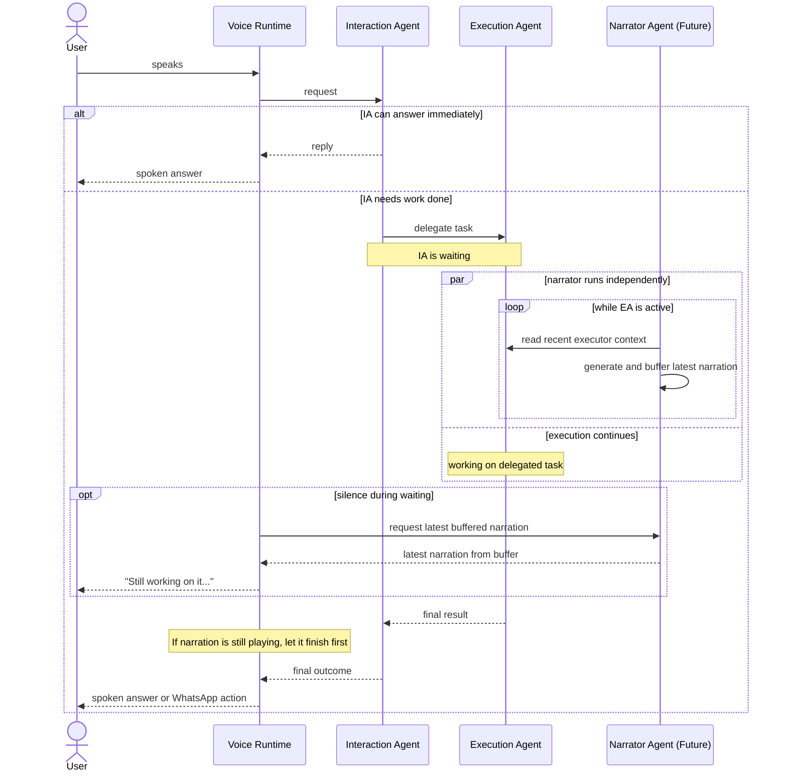
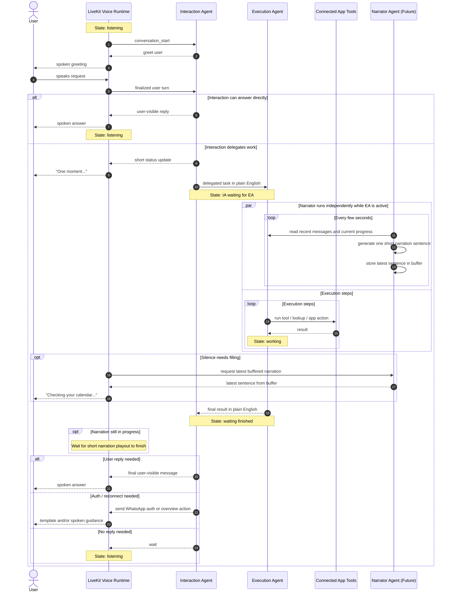

# WhatsApp Voice Agent Sequence

Short summary of the current voice-agent handoff and the future narrator hook.

- Shows the main agents and runtime boundaries
- Shows where the interaction agent enters a waiting state
- Shows where a future narrator agent can attach without owning execution

## Overview

## Detailed Sequence

## State Summary

- `listening`
  Voice runtime is idle and waiting for the next finalized user turn.

- `interaction active`
  The interaction agent is deciding whether to answer directly, delegate, or wait.

- `waiting for execution`
  The interaction agent has handed off work to the execution agent and is blocked on the result.

- `execution working`
  The execution agent is using connected app tools and building a final result for the interaction agent.

- `narration active` (future)
  A separate narrator agent continuously reads recent executor context, generates short narration candidates, and keeps the latest one in a buffer while the interaction agent is in `waiting for execution`.

- `final reply queued behind narration` (future)
  If a short narration is still playing when execution finishes, the final interaction reply waits for that narration playout to complete.

- `narration buffered` (future)
  The narrator agent may already have a fresh sentence ready before the voice runtime asks for one.

## Important Boundary

The interaction agent remains the only agent that owns the user conversation outcome:

- it decides when to delegate
- it decides whether the final outcome is a spoken reply, a WhatsApp auth action, or `wait`
- the narrator agent, if added later, only fills silence during the waiting period

The execution agent does not talk to the user directly. It only returns progress and a final result back into the interaction layer.

The narrator agent does not execute tools or decide outcomes. It continuously watches recent execution context, keeps a latest sentence in a buffer, and returns that buffered sentence when the voice runtime asks for one.

The narrator agent only generates text. The voice runtime decides whether to speak that text and is responsible for TTS playback.
